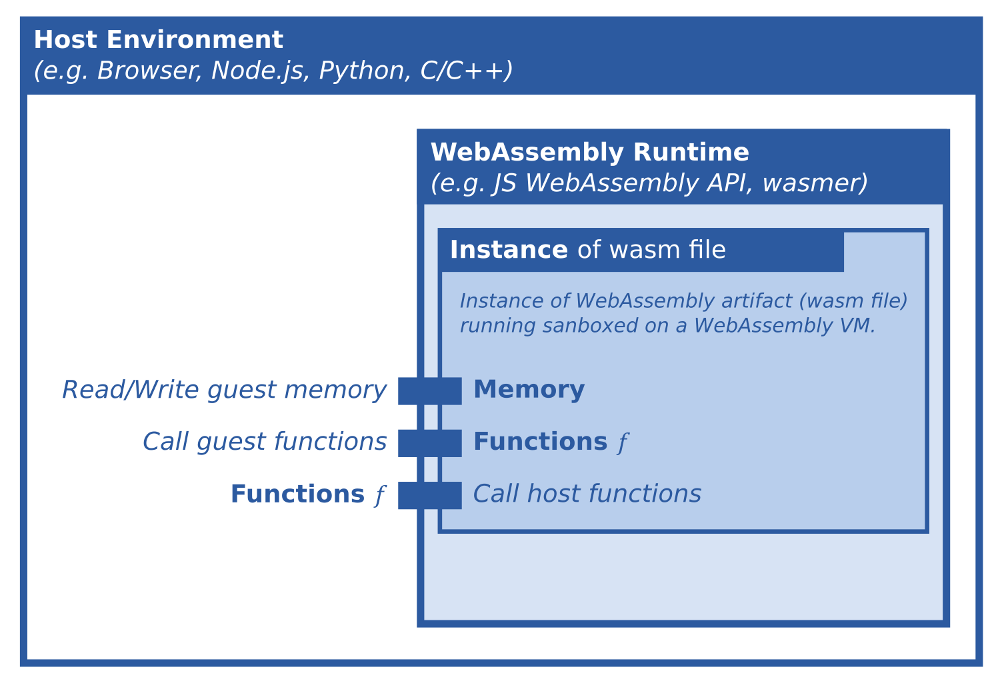

# WebAssembly: Das neue Docker und noch mehr?

> If WASM+WASI existed in 2008, we wouldn’t have needed to created Docker. That’s how important it is. Webassembly on the server is the future of computing. A standardized system interface was the missing link. Let’s hope WASI is up to the task!

— [Tweet](https://twitter.com/solomonstre/status/1111004913222324225 "Tweet"), Solomon Hykes (Erfinder von Docker), 2019

Dieser Tweet über WebAssembly (WASM) des Docker-Erfinders gibt einen Hinweis auf die mögliche Innovationskraft dieser Technologie. Der vorliegende Artikel vermittelt zunächst die wichtigsten technischen Grundlagen von WebAssembly, welche zum weiteren Verständnis notwendig sind. Anschließend wird der WASI-Standard näher beleuchtet, welcher die Brücke zur Containervirtualisierung schlägt. Schließlich betrachten wir mit Krustlet (Kubernetes) und wasmCloud zwei existierende Cloud-Technologien, die zentral auf WebAssembly basieren.

## 1. WebAssembly (WASM)

### 1.1. WebAssembly als Number Cruncher für JavaScript

> Any application that can be written in JavaScript, will eventually be written in JavaScript.

— [Atwood's Law](https://en.wikipedia.org/wiki/Jeff_Atwood "Atwood's Law"), Jeff Atwood (Mitgründer von StackOverflow)

Die gestiegene Popularität und weite Verbreitung von JavaScript (JS) innerhalb der vergangenen Jahre drückt sich pointiert im *Atwood'schen Gesetz* aus. Dieses besagt: Falls es möglich ist, dass eine Anwendung in JavaScript implementiert werden kann, wird das auch irgendwann so geschehen.

[JavaScript Engines](https://en.wikipedia.org/wiki/JavaScript_engine "JavaScript Engines") wurden im Zuge des Erfolgs der Sprache und des Wettbewerbs zwischen den Browsern beträchtlich [performanter](https://v8.dev/blog/10-years#performance-ups-and-downs "performanter"). Da JavaScript aber letztlich eine Sprache mit dynamischer Typisierung ist, unterliegt die Optimierung der Performance gewissen Grenzen. Daher ergibt es wenig Sinn, rechenintensive Anwendungen damit zu realisieren.

Für rechenintensive Anwendungen soll [WebAssembly (WASM)](https://webassembly.org/ "WebAssembly (WASM)") Abhilfe schaffen. Bei der Technologie handelt es sich um ein Bytecode-Format für eine entsprechende virtuelle Maschine (VM). WASM wurde so konzipiert, dass performante Sprachen wie z.B. [C/C++, Rust, AssemblyScript oder TinyGo](https://github.com/appcypher/awesome-wasm-langs "C/C++, Rust oder TinyGo") [19] für diese VM kompiliert werden können. Am Ende erhält man eine wasm-Datei, die den Bytecode enthält und in JavaScript dann über die [WebAssembly API](https://developer.mozilla.org/en-US/docs/Web/JavaScript/Reference/Global_Objects/WebAssembly "WebAssembly API") des Browsers (bzw. der JS Engine) geladen und ausgeführt werden kann. Das Minimalbeispiel im folgenden Kapitel soll den Workflow verdeutlichen.


— *Abb: Verschiedenste Sprachen können zu WebAssembly Bytecode kompiliert werden. Zeichnung von [Lin Clark](https://hacks.mozilla.org/2017/02/creating-and-working-with-webassembly-modules/) [18]*

### 1.2. Workflow / Beispielprojekt

Wir gehen von einem akademischen Beispiel aus, welches in der Quelltextdatei `program.c` implementiert wurde:

``` c
// program.c

void external_number_printer(int number);

int add(int a, int b) {
    int result = a + b;
    external_number_printer(result);
    return result;
}
```

Die Funktion `add()` gibt das Ergebnis einer Addition zurück. Zusätzlich wird die Funktion `external_number_printer()` mit dem Ergebnis aufgerufen. Diese wird erst zur Laufzeit durch JavaScript bereitgestellt und daher in C nur deklariert.

Übersetzt wird der Quelltext mit einem Compiler, welcher WASM als Zielarchitektur unterstützt. In diesem Beispiel mit [Clang (LLVM Projekt)](https://clang.llvm.org/ "Clang (LLVM)") [1]:

``` sh
clang --target=wasm32 --no-standard-libraries -Wl,--export-all -Wl,--no-entry -Wl,--allow-undefined -o program.wasm program.c
```

Ergebnis ist die Bytecode-Datei `program.wasm`. Diese kann in JavaScript geladen werden, um die Funktion `add()` auszuführen. Die Funktion `external_number_printer()` wird dabei per `importObject` bereitgestellt.

``` javascript
// script.js

function js_number_printer(number) {
    console.log('JS Number Printer: ' + number);
}

async function main() {
    const source = fetch('program.wasm');
    const importObject = { env: { external_number_printer: js_number_printer } };
    const { instance } = await WebAssembly.instantiateStreaming(source, importObject);

    const result = instance.exports.add(40, 2); // call webassembly function
    console.log('Result: ' + result);
}

main();
```

Die Konsolenausgabe von `script.js`:

```
> JS Number Printer: 42
> Result: 42
```

Die erste Zeile wird von der Funktion `js_number_printer()` erzeugt, welche von WASM aus aufgerufen wurde. Man spricht hier auch von einer *Host-Funktion* oder einer *importierten Funktion*. [4]

### 1.3. Weitere Eigenschaften & Konzepte


— *Abb: Zusammenhänge der wichtigsten Konzepte*

-   **Guest & Host:** Im obigen Beispiel nimmt der Browser (bzw. die JS Engine) die Rolle des Hosts ein. Guest ist das WASM-Programm.
-   **Sandboxing & Security:** WASM wird üblicherweise in einer isolierten Umgebung (Sandbox) ausgeführt, was zu einer gesteigerten Sicherheit führt. [2]
-   **Performance:** Der Bytecode wird beim Laden in nativen Maschinencode übersetzt [3], wodurch eine beinahe native Ausführungsgeschwindigkeit erreicht werden kann.
-   **Import/Export von Funktionen:** In beide Richtungen können Funktionen exportiert werden. D.h., dass JavaScript-Funktionen auch aus der VM heraus aufgerufen werden können.
-   **Datentypen:** WASM unterstützt die vier numerischen [Datentypen](https://webassembly.github.io/spec/core/syntax/types.html#number-types "Datentypen") `int32`, `int64`, `float32` und `float64`. Dementsprechend sind die Funktionssignaturen bei importierten/exportierten Funktionen auf diese Datentypen beschränkt.
-   **Memory:** Der komplette Speicher der VM kann von der Host-Seite aus [gelesen und geschrieben](https://developer.mozilla.org/en-US/docs/Web/JavaScript/Reference/Global_Objects/WebAssembly/Memory "gelesen und geschrieben") werden. Dies ermöglicht das Arbeiten mit Pointern auf beiden Seiten. So können Strings und komplexere Datenstrukturen übergeben werden.

## 2. WebAssembly außerhalb des Browsers

WASM spezifiziert eine vergleichsweise schlanke VM. Daher ist es mit relativ geringem Aufwand möglich, WASM auch in vielen andereren Sprachen auszuführen. Man benötigt für die Sprache, die als WASM-Host agieren soll, lediglich eine WASM Runtime. Eine aktuelle Übersicht verfügbarer Runtimes kann [hier](https://github.com/appcypher/awesome-wasm-runtimes) eingesehen werden.

Im Folgenden Beispiel wird das Beispiel aus 1.2 mit Python als Host und der WASM-Runtime [*wasmer*](https://wasmer.io/) reproduziert. Zunächst müssen die entsprechenden Python-Pakete für *wasmer* installiert werden:

``` sh
pip install wasmer wasmer_compiler_cranelift
```

Folgendes Python-Script kann dann ähnlich zur JavaScript-Variante den Bytecode aus `program.wasm` ausführen. Es lässt sich erkennen, dass die API von wasmer stark an die [WebAssembly API aus JavaScript](https://developer.mozilla.org/en-US/docs/Web/JavaScript/Reference/Global_Objects/WebAssembly) angelehnt ist.

``` python
# script.py
from wasmer import engine, Store, Module, ImportObject, \
                   Function, FunctionType, Type, Instance

def python_number_printer(number: int) -> None:
    print("Python Number Printer:", number)

# ----- compile the module ---------------------------
store = Store()
with open("program.wasm", "rb") as file:
    module = Module(store, file.read())

# ----- instantiate with imports ---------------------
import_object = ImportObject()
import_object.register("env", {
    "external_number_printer": Function(store, python_number_printer)
})
instance = Instance(module, import_object)

# ----- call WASM function ---------------------------
result = instance.exports.add(40, 2)
print("Result:", result)
```

Ergibt die Konsolenausgabe:

``` sh
Python Number Printer: 42
Result: 42
```

Das Beispiel verdeutlicht repräsentativ die einfache Integration von WASM in verschiedensten Sprachen. Dies fördert auch die Entstehung von Anwendungsszenarien außerhalb des Browsers:

-   **Blockchain:** Mit [Ethereum WebAssembly (EWASM)](https://t3n.de/news/ethereum-webassembly-smart-contracts-programmieren-1421559/) können für das Ethereum-Netzwerk sog. *[Smart Contracts](https://de.wikipedia.org/wiki/Ethereum#Smart_Contracts)* entwickelt werden.
-   **Embedded / IoT:** WASM kann hier zur Entkopplung von Applikationslogik und Hardware eingesetzt werden, womit die Portabilität gesteigert werden kann. Empfehlenswert hierzu sind die Talks von [Wallentowitz](https://www.youtube.com/watch?v=dKOKAHmdPsE) und [Lauwaerts](https://www.youtube.com/watch?v=p6_XGf_mXz8).
-   **Cloud:** WASM bietet attraktive Eigenschaften für Cloud und DevOps. Darunter die Portabilität sowie die Isolationsmöglichkeiten.

## 3. Mit WASI in Richtung Containervirtualisierung

Das Beispiel aus 1.2 enthält ein wichtiges Detail: Der Compiler-Befehl enthält die Option `--no-standard-libraries`. Das bedeutet, dass keine Funktionen aus der [C-Standard-Bibliothek (libc)](https://de.wikipedia.org/wiki/C-Standard-Bibliothek) verwendet werden können. Darunter fallen wichtige Funktionalitäten wie:

-   Öffnen, Lesen & Schreiben von Dateien (`stdio.h`)
-   Reservierung & Freigabe von Speicher (`stdlib.h`)
-   Datum und Uhrzeit (`time.h`)

Die aufgeführten Beispiele werden in der normalen "C-Welt" üblicherweise durch sog. [*Syscall*s (Systemaufrufe)](https://de.wikipedia.org/wiki/Systemaufruf) realisiert. Programme können mit Syscalls das Betriebssystem aufrufen, um auf bestimmte Funktionalitäten zuzugreifen. Dies ermöglicht z.B. den einfachen Umgang mit Dateien, ohne dass das Programm selbst Funktionalitäten wie Treiber für Festplatten und Dateisysteme mitbringen muss.

Um WASM Programme mit solchen Funktionalitäten auszustatten, wurde das [**WebAssembly System Interface (WASI)**](https://github.com/WebAssembly/WASI) ins Leben gerufen. WASI spezifiziert Schnittstellen für solche Funktionalitäten, die über das Number Crunching hinausgehen. Z.B. die Schnittstelle zum Öffnen von Dateien "[`[open-at]`](https://github.com/WebAssembly/wasi-filesystem/blob/bdbfecf90170a94f5bc4219fdb43839dd6953642/wasi-filesystem.abi.md#-descriptoropen-at)". Damit ist es möglich mit [wasi-libc](https://github.com/WebAssembly/wasi-libc) die C-Standard-Bibliothek für WASM Projekte zu nutzen. [16]

WASM-Programme, welche WASI nutzen, können ausgeführt werden, indem die Runtime die entsprechenden spezifizierten Schnittstellen als importierte Funktionen bereitstellt. Ein Beispiel für eine WASI-kompatible Runtime ist *[wasmtime](https://github.com/bytecodealliance/wasmtime)*. Mit *wasmtime* können WASM-Programme direkt "standalone" ausgeführt werden. Damit wird deutlich, dass hier weitere Arten von Isolation realisiert werden können. So kann einerseits vom WASM-Host festgelegt werden, welche Funktionalitäten von WASI überhaupt bereitgestellt werden. Des Weiteren können Systemschnitstellen wie z.B. das Dateisystem einfach virtualisiert werden, indem das Verhalten der Datei-Schnittstellen entsprechend angepasst wird. Z.B. könnte man das Dateisystem der VM in ein Verzeichnis des Hosts oder in eine Datenbank abbilden. [17]

Damit stehen die Grundlagen für die Containervirtualisierung bereit. Dadurch wird auch nachvollziehbar, weshalb Solomon Hykes in seinem Tweet WASM/WASI mit Docker in Zusammenhang brachte.